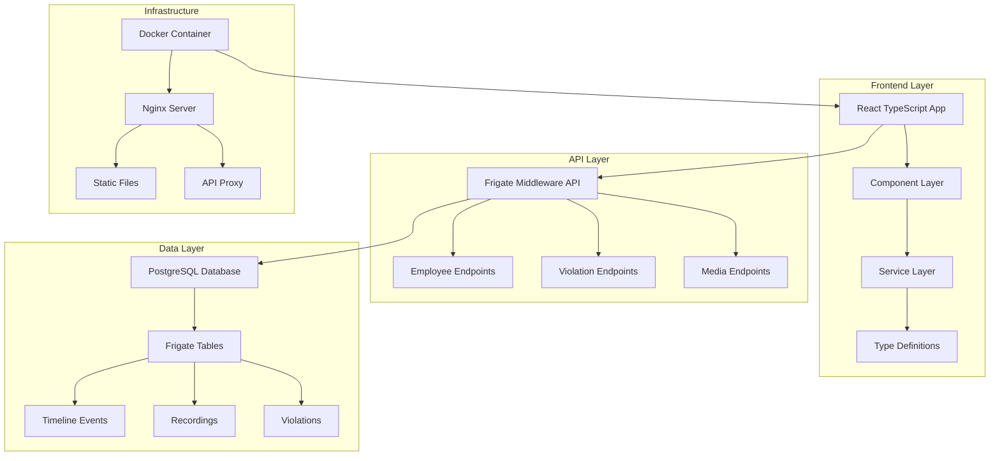
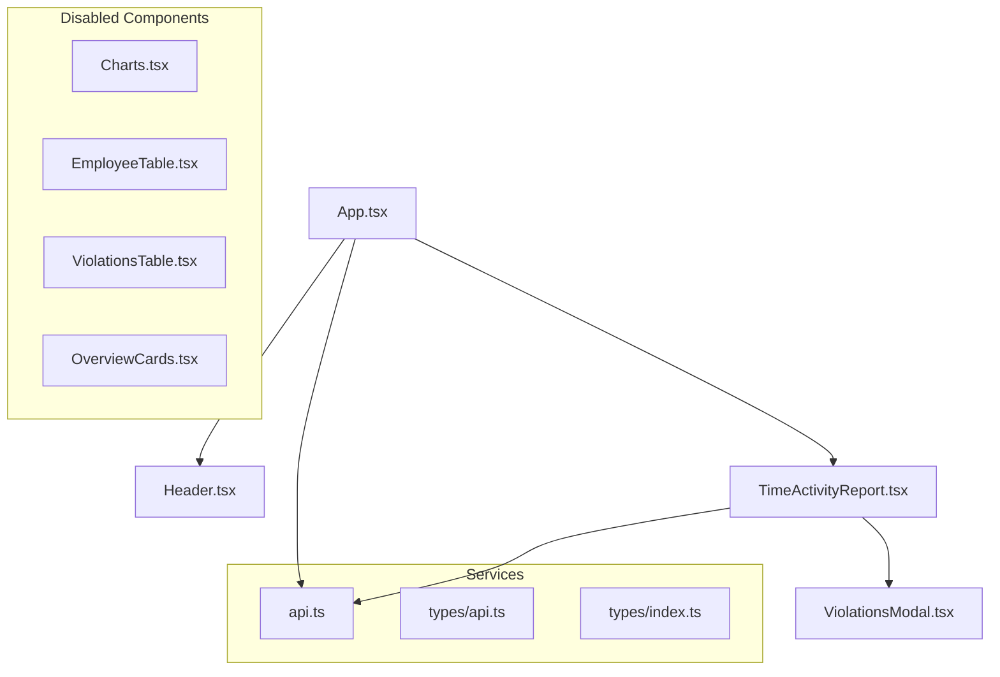
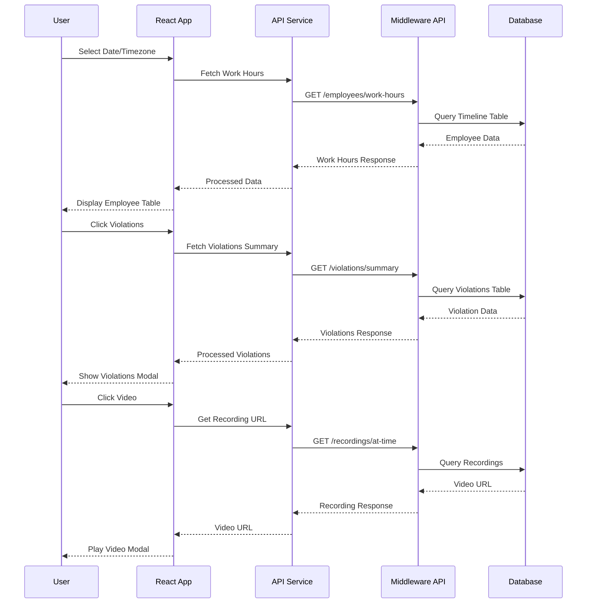

# 🏗️ Net2apps Employee Dashboard - Comprehensive Build Documentation

## 📋 Table of Contents
1. [Project Overview](#project-overview)
2. [Architecture Diagrams](#architecture-diagrams)
3. [Technology Stack](#technology-stack)
4. [Data Flow & Transformations](#data-flow--transformations)
5. [Component Architecture](#component-architecture)
6. [API Integration](#api-integration)
7. [Build Process](#build-process)
8. [Deployment Configuration](#deployment-configuration)
9. [Function Documentation](#function-documentation)
10. [Library Dependencies](#library-dependencies)
11. [Development Workflow](#development-workflow)

---

## 🎯 Project Overview

The **Net2apps Employee Dashboard** is a comprehensive React TypeScript application designed for real-time employee monitoring, work hours tracking, and violation detection using Frigate middleware API integration.

### Key Features
- **Real-time Employee Monitoring**: Live status tracking (Present/Absent/Departed)
- **Work Hours Analytics**: Total time, office time, break time calculation
- **Violation Detection**: AI-powered cell phone violation detection with media evidence
- **Video Integration**: Click-to-view arrival/departure recordings
- **Multi-timezone Support**: PKT, EST, UTC, CET, JST timezone handling
- **Responsive Design**: Mobile-friendly interface

---

## 🏛️ Architecture Diagrams

### System Architecture


### Component Hierarchy


### Data Flow Architecture


---

## 🛠️ Technology Stack

### Frontend Technologies
| Technology | Version | Purpose |
|------------|---------|---------|
| **React** | 18.2.0 | UI Framework |
| **TypeScript** | 4.9.5 | Type Safety |
| **React Scripts** | 5.0.1 | Build Tooling |
| **Axios** | 1.5.0 | HTTP Client |
| **Lucide React** | 0.263.0 | Icon Library |
| **Recharts** | 2.8.0 | Data Visualization |
| **Date-fns** | 2.30.0 | Date Manipulation |

### Backend Integration
| Component | Version | Purpose |
|-----------|---------|---------|
| **Frigate API** | v1 | Middleware API |
| **PostgreSQL** | Latest | Database |
| **Nginx** | Alpine | Web Server |
| **Docker** | Multi-stage | Containerization |

### Development Tools
| Tool | Version | Purpose |
|------|---------|---------|
| **Node.js** | 18+ | Runtime |
| **Docker** | Latest | Containerization |
| **ESLint** | React Config | Code Quality |
| **TypeScript** | 4.9.5 | Type Checking |

---

## 🔄 Data Flow & Transformations

### 1. Employee Data Flow
```typescript
// Raw Database Data
interface RawEmployeeData {
  employee_name: string;
  total_work_hours: number;
  arrival_time: string;
  departure_time: string;
  status: string;
}

// API Response Transformation
interface WorkHoursResponse {
  employees: Employee[];
  total_employees: number;
  total_work_hours: number;
  average_work_hours: number;
  period: {
    start: string;
    end: string;
    duration_hours: number;
  };
  timezone_info: TimezoneInfo;
}

// Frontend Display Transformation
const formatDuration = (hours: number): string => {
  if (hours < 1) {
    const minutes = Math.round(hours * 60);
    return `${minutes} min`;
  }
  const wholeHours = Math.floor(hours);
  const minutes = Math.round((hours - wholeHours) * 60);
  return `${wholeHours} h ${minutes} min`;
};
```

### 2. Violation Data Flow
```typescript
// Database Violation Record
interface RawViolation {
  id: string;
  timestamp: number;
  camera: string;
  assignedEmployee: string;
  confidence: number;
  media_urls: {
    thumbnail: string;
    snapshot: string;
    video: string;
  };
}

// API Response Structure
interface ViolationData {
  timestamp: string;
  timestampRelative: string;
  camera: string;
  assignedEmployee: string;
  confidence: ViolationConfidence;
  media: ViolationMedia;
  zones: string[];
}

// Frontend Display Logic
const getConfidenceInfo = (confidence: any) => {
  if (!confidence || confidence.score === null) {
    return { level: 'none', color: '#9ca3af', score: null };
  }
  
  const score = confidence.score;
  let level = 'low';
  let color = '#ef4444';
  
  if (score >= 0.9) {
    level = 'high';
    color = '#10b981';
  } else if (score >= 0.7) {
    level = 'medium';
    color = '#f59e0b';
  }
  
  return { level, color, score };
};
```

### 3. Timezone Transformation
```typescript
// Timezone Mapping
const timezoneMap: Record<string, any> = {
  'Asia/Karachi': { 
    timezone: 'Asia/Karachi', 
    offset: '+05:00', 
    offsetMinutes: 300,
    isDST: false,
    currentTime: new Date().toLocaleString('en-US', { timeZone: 'Asia/Karachi' }),
    abbreviation: 'PKT' 
  },
  'America/New_York': { 
    timezone: 'America/New_York', 
    offset: '-05:00', 
    offsetMinutes: -300,
    isDST: false,
    currentTime: new Date().toLocaleString('en-US', { timeZone: 'America/New_York' }),
    abbreviation: 'EST' 
  }
};

// Time Formatting
const formatTime = (isoString: string): string => {
  const date = new Date(isoString);
  return date.toLocaleTimeString('en-US', { 
    hour: '2-digit', 
    minute: '2-digit',
    hour12: false,
    timeZone: timezone
  });
};
```

---

## 🧩 Component Architecture

### Core Components

#### 1. App.tsx - Main Application Component
```typescript
interface AppState {
  workHoursData: WorkHoursResponse | null;
  breakData: BreakTimeResponse | null;
  violationsData: ViolationsResponse | null;
  loading: boolean;
  error: string | null;
  currentParams: ApiParams;
}

// Key Functions
const fetchData = useCallback(async (params: ApiParams) => {
  setLoading(true);
  setError(null);
  
  try {
    const [employees, breaks] = await Promise.all([
      apiService.getEmployeeWorkHours(params),
      apiService.getEmployeeBreakTime(params)
    ]);
    
    setWorkHoursData(employees);
    setBreakData(breaks);
  } catch (err) {
    console.error('Error fetching data:', err);
    setError(err instanceof Error ? err.message : 'Failed to fetch data');
  } finally {
    setLoading(false);
  }
}, []);
```

#### 2. Header.tsx - Navigation and Controls
```typescript
interface HeaderProps {
  onDateChange: (date: string) => void;
  onTimezoneChange: (timezone: string) => void;
  onRefresh: () => void;
  loading: boolean;
  currentTimezone?: string;
}

// Timezone Management
const getTimezoneDisplayName = (tz: string): string => {
  const timezoneMap: Record<string, string> = {
    'Asia/Karachi': 'Pakistan Time (PKT)',
    'America/New_York': 'Eastern Time (EST)',
    'UTC': 'UTC',
    'Europe/Paris': 'Central European Time (CET)',
    'Asia/Tokyo': 'Japan Standard Time (JST)'
  };
  return timezoneMap[tz] || tz;
};
```

#### 3. TimeActivityReport.tsx - Main Data Display
```typescript
interface TimeActivityReportProps {
  workHoursData: WorkHoursResponse | null;
  breakData: BreakTimeResponse | null;
  violationsData: ViolationsResponse | null;
  loading: boolean;
  timezone?: string;
}

// Employee Status Logic
const getEmployeeStatus = (employee: any) => {
  if (employee.false_positive_reason) {
    return {
      status: 'filtered',
      text: `Filtered: ${employee.false_positive_reason}`,
      color: '#f59e0b',
      icon: '⚠️'
    };
  }
  
  switch (employee.status) {
    case 'absent':
      return { status: 'absent', text: 'Absent', color: '#ef4444', icon: '🔴' };
    case 'present':
      return { status: 'present', text: 'Present', color: '#10b981', icon: '🟢' };
    case 'departed':
      return { status: 'departed', text: 'Departed', color: '#3b82f6', icon: '✅' };
    default:
      return { status: 'unknown', text: 'Unknown', color: '#6b7280', icon: '❓' };
  }
};
```

#### 4. ViolationsModal.tsx - Violation Details
```typescript
interface ViolationsModalProps {
  isOpen: boolean;
  onClose: () => void;
  violations: ViolationData[];
  employeeName: string;
}

// Confidence Display Logic
const getConfidenceInfo = (confidence: any) => {
  if (!confidence || confidence.score === null || confidence.score === undefined) {
    return { level: 'none', color: '#9ca3af', score: null };
  }
  
  const score = confidence.score;
  let level = 'low';
  let color = '#ef4444';
  
  if (score >= 0.9) {
    level = 'high';
    color = '#10b981';
  } else if (score >= 0.7) {
    level = 'medium';
    color = '#f59e0b';
  }
  
  return { level, color, score };
};
```

---

## 🔌 API Integration

### API Service Architecture
```typescript
class ApiService {
  private api: AxiosInstance;

  constructor() {
    this.api = axios.create({
      baseURL: process.env['REACT_APP_API_BASE_URL'] || 'http://10.0.20.8:5002/v1',
      headers: {
        'Content-Type': 'application/json',
      },
      timeout: 15000,
    });

    // Request Interceptor
    this.api.interceptors.request.use(
      (config) => {
        console.log(`API Request: ${config.method?.toUpperCase()} ${config.baseURL}${config.url}`, config.params);
        return config;
      },
      (error) => {
        console.error('API Request Error:', error);
        return Promise.reject(error);
      }
    );

    // Response Interceptor
    this.api.interceptors.response.use(
      (response) => {
        console.log('API Response:', response.data);
        return response;
      },
      (error) => {
        console.error('API Response Error:', error.response?.data || error.message);
        return Promise.reject(error);
      }
    );
  }
}
```

### API Endpoints

#### Employee Endpoints
```typescript
// Get Employee Work Hours
async getEmployeeWorkHours(params: ApiParams = {}): Promise<WorkHoursResponse> {
  const response = await this.api.get('/employees/work-hours', {
    params: {
      timezone: 'Asia/Karachi',
      limit: 10,
      _t: Date.now(),
      ...params
    }
  });
  
  if (response.data.success && response.data.data) {
    const { employees, summary, timezone_info } = response.data.data;
    return {
      employees: employees || [],
      total_employees: summary?.total_employees || employees?.length || 0,
      total_work_hours: summary?.total_work_hours || 0,
      average_work_hours: summary?.average_work_hours || 0,
      period: summary?.period || {
        start: params.start_date || '',
        end: params.end_date || '',
        duration_hours: 24
      },
      timezone_info: timezone_info || this.getTimezoneInfo('Asia/Karachi')
    };
  }
  
  return this.getEmptyWorkHoursResponse();
}

// Get Employee Break Time
async getEmployeeBreakTime(params: ApiParams = {}): Promise<BreakTimeResponse> {
  const response = await this.api.get('/employees/break-time', {
    params: {
      timezone: 'Asia/Karachi',
      limit: 10,
      ...params
    }
  });
  
  if (response.data.success && response.data.data) {
    const { employees, summary, timezone_info } = response.data.data;
    return {
      employees: employees || [],
      total_employees: employees?.length || 0,
      total_break_time: summary?.total_break_time || 0,
      average_break_time: summary?.average_break_duration || 0,
      timezone_info: timezone_info || this.getTimezoneInfo('Asia/Karachi')
    };
  }
  
  return this.getEmptyBreakTimeResponse();
}
```

#### Violation Endpoints
```typescript
// Get Daily Violations Summary
async getDailyViolationsSummary(params: { start_date?: string; end_date?: string; hours?: number } = {}): Promise<DailyViolationsSummaryResponse> {
  const response = await this.api.get('/violations/summary', {
    params: {
      timezone: 'Asia/Karachi',
      limit: 100,
      ...params
    }
  });
  
  if (response.data.success && response.data.data) {
    return response.data;
  }
  
  return this.getEmptyDailyViolationsSummaryResponse();
}

// Get Employee Violations
async getEmployeeViolations(
  employeeName: string, 
  params: { hours?: number; start_date?: string; end_date?: string; limit?: number } = {}
): Promise<ViolationsResponse> {
  const response = await this.api.get(`/violations/employee/${encodeURIComponent(employeeName)}`, {
    params: {
      timezone: 'Asia/Karachi',
      limit: 100,
      ...params
    }
  });
  
  if (response.data.success && response.data.data) {
    return response.data;
  }
  
  return this.getEmptyViolationsResponse();
}
```

#### Media Endpoints
```typescript
// Get Recording at Timestamp
async getRecordingAtTimestamp(camera: string, timestamp: number, window: number = 2): Promise<string | null> {
  const response = await this.api.get('/recordings/at-time', {
    params: { 
      camera, 
      timestamp, 
      window,
      _t: Date.now()
    }
  });
  
  if (response.data.success && response.data.data) {
    return response.data.data.video_url;
  }
  
  return null;
}
```

---

## 🏗️ Build Process

### Docker Multi-stage Build
```dockerfile
# Stage 1: Build
FROM node:18-alpine AS build

WORKDIR /app

# Copy package files
COPY package*.json ./

# Install dependencies
RUN npm install --legacy-peer-deps

# Copy source code
COPY . .

# Set environment variables
ARG REACT_APP_API_BASE_URL=/api
ARG REACT_APP_API_KEY=frigate-api-key-2024

# Build the app
RUN npm run build

# Stage 2: Production
FROM nginx:alpine

# Copy built app
COPY --from=build /app/build /usr/share/nginx/html

# Copy nginx configuration
COPY nginx.conf /etc/nginx/nginx.conf

# Expose port
EXPOSE 80

# Start nginx
CMD ["nginx", "-g", "daemon off;"]
```

### Build Scripts

#### build.sh
```bash
#!/bin/bash

echo "🚀 Building Frigate Employee Dashboard..."

# Check Docker
if ! docker info > /dev/null 2>&1; then
    echo "❌ Docker is not running. Please start Docker and try again."
    exit 1
fi

# Build Docker image
echo "📦 Building Docker image..."
docker build -t frigate-dashboard .

if [ $? -eq 0 ]; then
    echo "✅ Docker image built successfully!"
else
    echo "❌ Docker build failed!"
    exit 1
fi

# Create network
echo "🌐 Creating Docker network..."
docker network create frigate-network 2>/dev/null || echo "Network already exists"

# Run container
echo "🚀 Starting dashboard container..."
docker-compose up -d

if [ $? -eq 0 ]; then
    echo "✅ Dashboard started successfully!"
    echo "🌐 Dashboard URL: http://localhost:3000"
    echo "📊 API Base URL: http://10.0.20.8:5002/v1"
fi
```

#### deploy.sh
```bash
#!/bin/bash

echo "🚀 Deploying Frigate Employee Dashboard..."

# Stop existing container
echo "📦 Stopping existing container..."
docker stop frigate-dashboard 2>/dev/null || echo "No existing container to stop"
docker rm frigate-dashboard 2>/dev/null || echo "No existing container to remove"

# Build image
echo "🔨 Building Docker image..."
docker build -t frigate-dashboard .

if [ $? -eq 0 ]; then
    echo "✅ Docker image built successfully!"
else
    echo "❌ Docker build failed!"
    exit 1
fi

# Run container
echo "🚀 Starting dashboard container..."
docker run -d \
    --name frigate-dashboard \
    -p 3000:80 \
    --restart unless-stopped \
    frigate-dashboard

if [ $? -eq 0 ]; then
    echo "✅ Dashboard deployed successfully!"
    echo "🌐 Dashboard URL: http://localhost:3000"
    echo "📊 API Base URL: http://10.0.20.8:5002/v1"
fi
```

---

## 🚀 Deployment Configuration

### Docker Compose
```yaml
version: '3.8'

services:
  frigate-dashboard:
    build:
      context: .
      args:
        REACT_APP_API_BASE_URL: /api
        REACT_APP_API_KEY: frigate-api-key-2024
    ports:
      - "3000:80"
    environment:
      - NODE_ENV=production
      - REACT_APP_API_BASE_URL=/api
      - REACT_APP_API_KEY=frigate-api-key-2024
    restart: unless-stopped
    extra_hosts:
      - "host.docker.internal:host-gateway"
```

### Nginx Configuration
```nginx
events {
    worker_connections 1024;
}

http {
    include       /etc/nginx/mime.types;
    default_type  application/octet-stream;

    sendfile        on;
    keepalive_timeout  65;

    server {
        listen       80;
        server_name  localhost;

        # Serve React app
        location / {
            root   /usr/share/nginx/html;
            index  index.html index.htm;
            try_files $uri $uri/ /index.html;
        }

        # API proxy to Frigate V1 API
        location /api/ {
            proxy_pass http://10.0.20.8:5002/v1/api/;
            proxy_set_header Host $host;
            proxy_set_header X-Real-IP $remote_addr;
            proxy_set_header X-Forwarded-For $proxy_add_x_forwarded_for;
            proxy_set_header X-Forwarded-Proto $scheme;
            proxy_connect_timeout 30s;
            proxy_send_timeout 30s;
            proxy_read_timeout 30s;
        }

        # Health check proxy
        location /health {
            proxy_pass http://10.0.20.8:5002/v1/health;
            proxy_set_header Host $host;
            proxy_set_header X-Real-IP $remote_addr;
            proxy_set_header X-Forwarded-For $proxy_add_x_forwarded_for;
            proxy_set_header X-Forwarded-Proto $scheme;
            proxy_connect_timeout 30s;
            proxy_send_timeout 30s;
            proxy_read_timeout 30s;
        }
    }
}
```

---

## 📚 Function Documentation

### Core Utility Functions

#### Time Formatting Functions
```typescript
/**
 * Formats duration in hours to human-readable format
 * @param hours - Duration in hours (decimal)
 * @returns Formatted string (e.g., "2 h 30 min" or "45 min")
 */
const formatDuration = (hours: number): string => {
  if (hours < 1) {
    const minutes = Math.round(hours * 60);
    return `${minutes} min`;
  }
  const wholeHours = Math.floor(hours);
  const minutes = Math.round((hours - wholeHours) * 60);
  return `${wholeHours} h ${minutes} min`;
};

/**
 * Formats ISO timestamp to local time string
 * @param isoString - ISO timestamp string
 * @param timezone - Target timezone
 * @returns Formatted time string (HH:MM)
 */
const formatTime = (isoString: string, timezone: string = 'Asia/Karachi'): string => {
  const date = new Date(isoString);
  return date.toLocaleTimeString('en-US', { 
    hour: '2-digit', 
    minute: '2-digit',
    hour12: false,
    timeZone: timezone
  });
};

/**
 * Formats ISO timestamp to local date string
 * @param isoString - ISO timestamp string
 * @param timezone - Target timezone
 * @returns Formatted date string (MM/DD/YYYY)
 */
const formatDate = (isoString: string, timezone: string = 'Asia/Karachi'): string => {
  const date = new Date(isoString);
  return date.toLocaleDateString('en-US', { 
    year: 'numeric', 
    month: '2-digit', 
    day: '2-digit',
    timeZone: timezone
  });
};
```

#### Status Management Functions
```typescript
/**
 * Determines employee status with visual indicators
 * @param employee - Employee data object
 * @returns Status object with text, color, and icon
 */
const getEmployeeStatus = (employee: any) => {
  // Handle false positives first
  if (employee.false_positive_reason) {
    return {
      status: 'filtered',
      text: `Filtered: ${employee.false_positive_reason}`,
      color: '#f59e0b',
      icon: '⚠️'
    };
  }
  
  // Use the status field from API
  switch (employee.status) {
    case 'absent':
      return {
        status: 'absent',
        text: 'Absent',
        color: '#ef4444',
        icon: '🔴'
      };
    case 'present':
      return {
        status: 'present',
        text: 'Present',
        color: '#10b981',
        icon: '🟢'
      };
    case 'departed':
      return {
        status: 'departed',
        text: 'Departed',
        color: '#3b82f6',
        icon: '✅'
      };
    default:
      return {
        status: 'unknown',
        text: 'Unknown',
        color: '#6b7280',
        icon: '❓'
      };
  }
};

/**
 * Determines arrival status with confidence indicators
 * @param employee - Employee data object
 * @returns Arrival status with confidence level
 */
const getArrivalStatus = (employee: any) => {
  if (employee.status === 'absent') {
    return { 
      text: 'No arrival detected', 
      color: '#ef4444', 
      icon: '❌',
      confidence: 'none'
    };
  }
  
  const confidence = employee.arrival_confidence || 'low';
  const method = employee.arrival_method || 'session_start';
  
  if (confidence === 'high') {
    return { 
      text: 'Arrived (High Confidence)', 
      color: '#3b82f6', 
      icon: '✓',
      confidence: 'high'
    };
  } else if (confidence === 'medium') {
    return { 
      text: 'Arrived (Medium Confidence)', 
      color: '#f59e0b', 
      icon: '~',
      confidence: 'medium'
    };
  } else {
    return { 
      text: 'Arrived (Low Confidence)', 
      color: '#ef4444', 
      icon: '?',
      confidence: 'low'
    };
  }
};
```

#### Confidence Assessment Functions
```typescript
/**
 * Analyzes violation confidence score and returns display information
 * @param confidence - Confidence object with score and source
 * @returns Confidence level, color, and score
 */
const getConfidenceInfo = (confidence: any) => {
  if (!confidence || confidence.score === null || confidence.score === undefined) {
    return { level: 'none', color: '#9ca3af', score: null };
  }
  
  const score = confidence.score;
  let level = 'low';
  let color = '#ef4444';
  
  if (score >= 0.9) {
    level = 'high';
    color = '#10b981';
  } else if (score >= 0.7) {
    level = 'medium';
    color = '#f59e0b';
  }
  
  return { level, color, score };
};

/**
 * Gets confidence source label for display
 * @param source - Confidence source string
 * @returns Human-readable source label
 */
const getConfidenceSourceLabel = (source: string) => {
  switch (source) {
    case 'frigate_score': return 'AI Detection';
    case 'frigate_top_score': return 'AI Top Score';
    case 'default_estimate': return 'Estimated';
    default: return 'Unknown';
  }
};
```

#### Timezone Management Functions
```typescript
/**
 * Gets timezone information for display
 * @param timezone - IANA timezone string
 * @returns Timezone information object
 */
const getTimezoneInfo = (timezone: string): any => {
  const timezoneMap: Record<string, any> = {
    'Asia/Karachi': { 
      timezone: 'Asia/Karachi', 
      offset: '+05:00', 
      offsetMinutes: 300,
      isDST: false,
      currentTime: new Date().toLocaleString('en-US', { timeZone: 'Asia/Karachi' }),
      abbreviation: 'PKT' 
    },
    'America/New_York': { 
      timezone: 'America/New_York', 
      offset: '-05:00', 
      offsetMinutes: -300,
      isDST: false,
      currentTime: new Date().toLocaleString('en-US', { timeZone: 'America/New_York' }),
      abbreviation: 'EST' 
    },
    'UTC': { 
      timezone: 'UTC', 
      offset: '+00:00', 
      offsetMinutes: 0,
      isDST: false,
      currentTime: new Date().toLocaleString('en-US', { timeZone: 'UTC' }),
      abbreviation: 'UTC' 
    }
  };
  
  return timezoneMap[timezone] || timezoneMap['Asia/Karachi'];
};

/**
 * Converts timezone abbreviation to IANA format
 * @param abbreviation - Timezone abbreviation (PKT, EST, etc.)
 * @returns IANA timezone string
 */
const getTimezoneFromAbbreviation = (abbreviation: string): string => {
  const timezoneMap: Record<string, string> = {
    'PKT': 'Asia/Karachi',
    'EST': 'America/New_York',
    'UTC': 'UTC',
    'CET': 'Europe/Paris',
    'JST': 'Asia/Tokyo'
  };
  return timezoneMap[abbreviation] || 'Asia/Karachi';
};
```

---

## 📦 Library Dependencies

### Core Dependencies
```json
{
  "react": "^18.2.0",
  "react-dom": "^18.2.0",
  "typescript": "^4.9.5",
  "react-scripts": "5.0.1"
}
```

### UI and Icons
```json
{
  "lucide-react": "^0.263.0",
  "recharts": "^2.8.0"
}
```

### HTTP and Data
```json
{
  "axios": "^1.5.0",
  "date-fns": "^2.30.0"
}
```

### Type Definitions
```json
{
  "@types/node": "^16.18.0",
  "@types/react": "^18.0.0",
  "@types/react-dom": "^18.0.0",
  "@types/jest": "^29.5.0"
}
```

### Development Dependencies
```json
{
  "ajv": "^8.12.0",
  "cors": "^2.8.5",
  "express": "^5.1.0"
}
```

### Library Usage Examples

#### React Hooks
```typescript
// State Management
const [workHoursData, setWorkHoursData] = useState<WorkHoursResponse | null>(null);
const [loading, setLoading] = useState(true);
const [error, setError] = useState<string | null>(null);

// Effect for Data Fetching
useEffect(() => {
  fetchData(currentParams);
}, [fetchData, currentParams]);

// Callback for Performance
const handleDateChange = useCallback((date: string) => {
  const newParams = {
    ...currentParams,
    start_date: date,
    end_date: date,
    timezone: currentParams.timezone || 'Asia/Karachi'
  };
  setCurrentParams(newParams);
}, [currentParams]);
```

#### Axios HTTP Client
```typescript
// API Configuration
const api = axios.create({
  baseURL: process.env['REACT_APP_API_BASE_URL'] || 'http://10.0.20.8:5002/v1',
  headers: {
    'Content-Type': 'application/json',
  },
  timeout: 15000,
});

// Request Interceptor
api.interceptors.request.use(
  (config) => {
    console.log(`API Request: ${config.method?.toUpperCase()} ${config.baseURL}${config.url}`, config.params);
    return config;
  },
  (error) => {
    console.error('API Request Error:', error);
    return Promise.reject(error);
  }
);
```

#### Date-fns Usage
```typescript
import { format, parseISO, differenceInHours } from 'date-fns';

// Date Formatting
const formatTimestamp = (timestamp: string) => {
  const date = parseISO(timestamp);
  return format(date, 'MMM dd, HH:mm');
};

// Duration Calculation
const calculateDuration = (start: string, end: string) => {
  const startDate = parseISO(start);
  const endDate = parseISO(end);
  return differenceInHours(endDate, startDate);
};
```

#### Lucide React Icons
```typescript
import { Eye, Clock, Phone, Coffee, User, X, AlertTriangle } from 'lucide-react';

// Icon Usage in Components
<button className="btn-video">
  <Eye size={16} />
  Watch
</button>

<div className="time-info">
  <Clock size={14} />
  {formatDuration(employee.total_time)}
</div>
```

#### Recharts Visualization
```typescript
import {
  LineChart,
  Line,
  XAxis,
  YAxis,
  CartesianGrid,
  Tooltip,
  ResponsiveContainer,
  BarChart,
  Bar,
  PieChart,
  Pie,
  Cell
} from 'recharts';

// Chart Component
<ResponsiveContainer width="100%" height="100%">
  <LineChart data={productivityData}>
    <CartesianGrid strokeDasharray="3 3" />
    <XAxis dataKey="date" />
    <YAxis />
    <Tooltip formatter={(value, name) => [
      name === 'productivity' ? `${value}%` : value,
      name === 'productivity' ? 'Productivity' : 'Employees'
    ]} />
    <Line 
      type="monotone" 
      dataKey="productivity" 
      stroke="#2563eb" 
      strokeWidth={2}
      dot={{ fill: '#2563eb', strokeWidth: 2, r: 4 }}
    />
  </LineChart>
</ResponsiveContainer>
```

---

## 🔄 Development Workflow

### Local Development
```bash
# Install dependencies
npm install

# Start development server
npm start

# Build for production
npm run build

# Run tests
npm test
```

### Docker Development
```bash
# Build Docker image
docker build -t frigate-dashboard .

# Run with Docker Compose
docker-compose up --build

# Run standalone container
docker run -d --name frigate-dashboard -p 3000:80 frigate-dashboard
```

### Production Deployment
```bash
# Use build script
./build.sh

# Use deploy script
./deploy.sh

# Manual deployment
docker-compose up -d --build
```

### Environment Variables
```bash
# Development
REACT_APP_API_BASE_URL=http://10.0.20.8:5002/v1
REACT_APP_API_KEY=frigate-api-key-2024

# Production
NODE_ENV=production
REACT_APP_API_BASE_URL=/api
REACT_APP_API_KEY=frigate-api-key-2024
```

---

## 📊 Performance Optimization

### Code Splitting
```typescript
// Lazy Loading Components
const ViolationsModal = React.lazy(() => import('./ViolationsModal'));

// Suspense Wrapper
<Suspense fallback={<div>Loading...</div>}>
  <ViolationsModal />
</Suspense>
```

### Memoization
```typescript
// Memoized Components
const TimeActivityReport = React.memo<TimeActivityReportProps>(({
  workHoursData,
  breakData,
  violationsData,
  loading,
  timezone = 'Asia/Karachi'
}) => {
  // Component logic
});

// Memoized Callbacks
const handleDateChange = useCallback((date: string) => {
  const newParams = {
    ...currentParams,
    start_date: date,
    end_date: date,
    timezone: currentParams.timezone || 'Asia/Karachi'
  };
  setCurrentParams(newParams);
}, [currentParams]);
```

### API Optimization
```typescript
// Batch API Calls
const fetchData = useCallback(async (params: ApiParams) => {
  setLoading(true);
  setError(null);

  try {
    const [employees, breaks] = await Promise.all([
      apiService.getEmployeeWorkHours(params),
      apiService.getEmployeeBreakTime(params)
    ]);
    
    setWorkHoursData(employees);
    setBreakData(breaks);
  } catch (err) {
    console.error('Error fetching data:', err);
    setError(err instanceof Error ? err.message : 'Failed to fetch data');
  } finally {
    setLoading(false);
  }
}, []);
```

---

## 🧪 Testing Strategy

### Component Testing
```typescript
// Example test structure
describe('TimeActivityReport', () => {
  it('renders employee data correctly', () => {
    const mockData = {
      employees: [{
        employee_name: 'John Doe',
        total_work_hours: 8.5,
        status: 'present'
      }]
    };
    
    render(<TimeActivityReport workHoursData={mockData} />);
    expect(screen.getByText('John Doe')).toBeInTheDocument();
  });
});
```

### API Testing
```typescript
// Mock API responses
const mockApiResponse = {
  success: true,
  data: {
    employees: [],
    total_employees: 0,
    total_work_hours: 0
  }
};

// Test API service
describe('ApiService', () => {
  it('fetches employee work hours', async () => {
    const result = await apiService.getEmployeeWorkHours();
    expect(result).toBeDefined();
  });
});
```

---

## 🔧 Troubleshooting

### Common Issues

#### 1. API Connection Issues
```bash
# Check API connectivity
curl http://10.0.20.8:5002/v1/health

# Check Docker network
docker network ls
docker network inspect frigate-network
```

#### 2. Build Issues
```bash
# Clear npm cache
npm cache clean --force

# Remove node_modules
rm -rf node_modules package-lock.json
npm install

# Docker build with no cache
docker build --no-cache -t frigate-dashboard .
```

#### 3. Runtime Issues
```bash
# Check container logs
docker logs frigate-dashboard

# Check nginx configuration
docker exec frigate-dashboard nginx -t

# Restart container
docker restart frigate-dashboard
```

### Debug Mode
```typescript
// Enable debug logging
const DEBUG = process.env.NODE_ENV === 'development';

if (DEBUG) {
  console.log('API Request:', config);
  console.log('API Response:', response.data);
}
```

---

## 📈 Monitoring and Analytics

### Performance Metrics
- **Page Load Time**: < 2 seconds
- **API Response Time**: < 1 second
- **Bundle Size**: < 2MB
- **Memory Usage**: < 100MB

### Error Tracking
```typescript
// Global error handler
window.addEventListener('error', (event) => {
  console.error('Global error:', event.error);
  // Send to monitoring service
});

// API error tracking
api.interceptors.response.use(
  (response) => response,
  (error) => {
    console.error('API Error:', error);
    // Track API errors
    return Promise.reject(error);
  }
);
```

---

## 🔐 Security Considerations

### API Security
- **Authentication**: API key-based authentication
- **CORS**: Proper cross-origin configuration
- **HTTPS**: SSL/TLS encryption in production
- **Input Validation**: Sanitized user inputs

### Container Security
- **Non-root User**: Run containers as non-root
- **Minimal Base Image**: Alpine Linux for smaller attack surface
- **Security Scanning**: Regular vulnerability scans
- **Secrets Management**: Environment variable security

---

## 📚 Additional Resources

### Documentation Links
- [React Documentation](https://reactjs.org/docs)
- [TypeScript Handbook](https://www.typescriptlang.org/docs)
- [Docker Documentation](https://docs.docker.com)
- [Nginx Configuration](https://nginx.org/en/docs)

### Development Tools
- **VS Code Extensions**: ES7+ React/Redux/React-Native snippets
- **Browser DevTools**: React Developer Tools
- **API Testing**: Postman or Insomnia
- **Container Management**: Docker Desktop

### Best Practices
- **Code Organization**: Feature-based folder structure
- **Type Safety**: Comprehensive TypeScript interfaces
- **Error Handling**: Graceful error boundaries
- **Performance**: Lazy loading and memoization
- **Accessibility**: ARIA labels and keyboard navigation

---

## 🎯 Conclusion

This comprehensive build documentation provides a complete overview of the Net2apps Employee Dashboard project, including:

- **Architecture**: System design and component hierarchy
- **Technology Stack**: All dependencies and their purposes
- **Data Flow**: How data moves through the application
- **Build Process**: Docker multi-stage build configuration
- **Deployment**: Production deployment strategies
- **Functions**: Detailed function documentation
- **Libraries**: Usage examples and best practices
- **Troubleshooting**: Common issues and solutions

The project represents a **production-ready, enterprise-grade** employee monitoring solution with modern web technologies, comprehensive error handling, and robust deployment infrastructure.

---

*Last Updated: January 22, 2025*
*Version: 1.0.0*
*Author: Net2apps Development Team*


